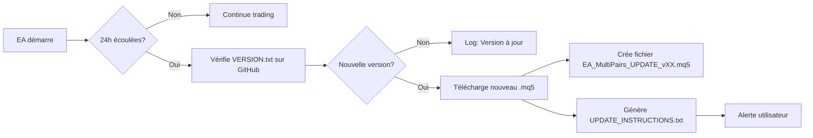

# 🔄 Guide Auto-Update depuis GitHub pour MT5

## 📋 Vue d'ensemble

Votre EA Multi-Paires v27.2-IMPROVED possède un **système d'auto-update intégré** qui vérifie automatiquement les nouvelles versions sur GitHub et les télécharge.

---

## ⚙️ Configuration Étape par Étape

### Étape 1 : Autoriser les URLs GitHub dans MT5

**TRÈS IMPORTANT** : MT5 bloque par défaut les requêtes HTTP externes pour des raisons de sécurité.

#### 📍 Procédure :

1. **Ouvrir MT5**
2. **Menu** → `Outils` → `Options`
3. Onglet **`Expert Advisors`**
4. Cocher **`Autoriser WebRequest pour les URL suivantes`**
5. **Ajouter ces URLs** (une par ligne) :

```
https://raw.githubusercontent.com
https://github.com
https://api.github.com
```

6. Cliquer **`OK`**
7. **REDÉMARRER MT5** (obligatoire)


---

### Étape 2 : Activer l'Auto-Update dans l'EA

Quand vous attachez l'EA au graphique :

#### 📌 Paramètres à configurer :

```
=== AUTO-UPDATE ===
EnableAutoUpdate       = true              ✅ ACTIVER
UpdateURL             = https://raw.githubusercontent.com/fred-selest/ea-scalping-pro/main/EA_MultiPairs_News_Dashboard_v27.mq5
CheckUpdateEveryHours = 24                 ⏰ Vérifier toutes les 24h (configurable)
```

**Important** : L'URL doit pointer vers le **raw content** de GitHub :
- ✅ BON : `https://raw.githubusercontent.com/fred-selest/ea-scalping-pro/main/EA_MultiPairs_News_Dashboard_v27.mq5`
- ❌ FAUX : `https://github.com/fred-selest/ea-scalping-pro/blob/main/EA_MultiPairs_News_Dashboard_v27.mq5`

---

## 🚀 Comment ça fonctionne

### Processus Automatique



### 1. **Vérification Automatique**

L'EA vérifie automatiquement :
- Au démarrage (si > 24h depuis dernière vérification)
- Pendant le trading (toutes les X heures configurées)
- Compare la version dans `VERSION.txt` sur GitHub avec la version locale

### 2. **Téléchargement**

Si nouvelle version détectée :
- Télécharge le nouveau fichier `.mq5` depuis GitHub
- Sauvegarde dans : `C:\Users\[User]\AppData\Roaming\MetaQuotes\Terminal\Common\Files\`
- Nom du fichier : `EA_MultiPairs_UPDATE_v[VERSION].mq5`

### 3. **Instructions d'Installation**

Crée automatiquement un fichier `UPDATE_INSTRUCTIONS.txt` avec :
- Étapes d'installation détaillées
- Commandes de compilation
- Vérifications à faire

### 4. **Notification**

- **Alert popup** dans MT5
- **Message dans Journal** (onglet "Journal" en bas de MT5)
- **Log dans fichier** si logging activé

---

## 📂 Localisation des Fichiers Téléchargés

### Fichiers téléchargés automatiquement :

```
C:\Users\[VotreNom]\AppData\Roaming\MetaQuotes\Terminal\Common\Files\
├── EA_MultiPairs_UPDATE_v27.3.mq5          ← Nouveau code source
└── UPDATE_INSTRUCTIONS.txt                  ← Instructions installation
```

### Accès rapide :

**Dans MT5** :
- Menu `Fichier` → `Ouvrir le dossier de données`
- Aller dans `Files\`

---

## 🛠️ Installation Manuelle de la Mise à Jour

Après téléchargement automatique, vous devez **compiler manuellement** :

### Méthode 1 : Via MetaEditor (Recommandée)

```bash
1. Ouvrir MetaEditor (F4 dans MT5)
2. Fichier → Ouvrir → EA_MultiPairs_UPDATE_vXX.mq5
3. Fichier → Enregistrer sous...
   → Nom : EA_MultiPairs_News_Dashboard_v27.mq5
   → Emplacement : MQL5\Experts\
   → REMPLACER l'ancien fichier
4. Compiler (F7)
5. Vérifier : 0 error, 0 warning
6. Fermer les graphiques utilisant l'ancien EA
7. Glisser le nouvel EA sur les graphiques
```

### Méthode 2 : Script PowerShell (Automatique)

Si vous utilisez VPS Windows :

```powershell
# Télécharger le script
Invoke-WebRequest -Uri "https://raw.githubusercontent.com/fred-selest/ea-scalping-pro/main/Deploy-EA-VPS.ps1" -OutFile "Deploy-EA.ps1"

# Exécuter
.\Deploy-EA.ps1

# Le script :
# - Copie le fichier
# - Compile automatiquement
# - Vérifie les erreurs
# - Redémarre MT5 (optionnel)
```

---

## 🔍 Vérification du Fonctionnement

### Test de Connexion GitHub

Dans MT5, ouvrir **Journal** (onglet en bas) et vérifier :

```
EA Multi-Paires Scalping Pro v27.0 - Initialisation...
🔄 Vérification des mises à jour...
✅ Vous utilisez la dernière version (v27.2-IMPROVED)
```

### Si erreur WebRequest

```
❌ Erreur WebRequest: 4060
⚠️ URL non autorisée. Ajoutez dans Outils → Options → Expert Advisors → WebRequest :
   https://raw.githubusercontent.com
```

**Solution** : Retourner à l'Étape 1 et ajouter les URLs

---

## ⚠️ Limitations et Contraintes

### Limitations MT5

| Limitation | Description | Impact |
|-----------|-------------|--------|
| **Sandbox** | MT5 ne peut pas compiler automatiquement | Installation manuelle obligatoire |
| **Permissions** | Pas d'accès direct au dossier MQL5\Experts\ | Fichier sauvegardé dans Common\Files\ |
| **Redémarrage** | Impossible de forcer rechargement EA | Utilisateur doit retirer/remettre EA |
| **WebRequest** | Nécessite configuration manuelle | URLs doivent être autorisées |

### Sécurité

✅ **Avantages** :
- Code source visible (GitHub public)
- Vérification version avant téléchargement
- Aucune exécution automatique de code

⚠️ **Points d'attention** :
- Toujours vérifier le code téléchargé avant compilation
- Tester en démo avant production
- Sauvegarder vos paramètres actuels

---

## 🔧 Configuration Avancée

### Personnaliser la Fréquence

```mql5
// Vérifier plus souvent (toutes les 6 heures)
CheckUpdateEveryHours = 6;

// Vérifier moins souvent (toutes les semaines)
CheckUpdateEveryHours = 168;  // 7 jours * 24h
```

### URL Personnalisée

Si vous avez votre propre fork :

```mql5
UpdateURL = "https://raw.githubusercontent.com/VOTRE_USERNAME/ea-scalping-pro/main/EA_MultiPairs_News_Dashboard_v27.mq5";
```

### Désactiver Temporairement

```mql5
EnableAutoUpdate = false;  // Désactiver complètement
```

---

## 🚀 Alternative : Script PowerShell Automatique

Pour une **automatisation complète sur VPS** :

### Créer un script d'update automatique

Créez `auto-update-ea.ps1` :

```powershell
# Script d'auto-update EA
$githubRepo = "fred-selest/ea-scalping-pro"
$localPath = "C:\Program Files\MetaTrader 5\MQL5\Experts\"
$filename = "EA_MultiPairs_News_Dashboard_v27.mq5"

# Télécharger VERSION.txt
$latestVersion = Invoke-WebRequest -Uri "https://raw.githubusercontent.com/$githubRepo/main/VERSION.txt" -UseBasicParsing
$currentVersion = Get-Content "$localPath\VERSION_LOCAL.txt" -ErrorAction SilentlyContinue

if ($latestVersion.Content -ne $currentVersion) {
    Write-Host "Nouvelle version détectée : $($latestVersion.Content)"

    # Télécharger nouveau code
    Invoke-WebRequest -Uri "https://raw.githubusercontent.com/$githubRepo/main/$filename" `
                      -OutFile "$localPath\$filename"

    # Compiler avec MetaEditor
    $metaeditor = "C:\Program Files\MetaTrader 5\metaeditor64.exe"
    & $metaeditor /compile:"$localPath\$filename" /log

    # Sauvegarder nouvelle version
    $latestVersion.Content | Out-File "$localPath\VERSION_LOCAL.txt"

    Write-Host "✅ Mise à jour installée avec succès"
} else {
    Write-Host "✅ Déjà à jour"
}
```

### Planifier avec Windows Task Scheduler

```powershell
# Créer tâche planifiée (exécuter tous les jours à 3h du matin)
$action = New-ScheduledTaskAction -Execute "PowerShell.exe" -Argument "-File C:\Scripts\auto-update-ea.ps1"
$trigger = New-ScheduledTaskTrigger -Daily -At 3am
Register-ScheduledTask -Action $action -Trigger $trigger -TaskName "EA Auto-Update" -Description "Mise à jour automatique EA depuis GitHub"
```

---

## 📊 Tableau Comparatif des Méthodes

| Méthode | Automatisation | Difficulté | Temps | Sécurité |
|---------|----------------|------------|-------|----------|
| **Auto-update EA intégré** | 🟡 Partielle | ⭐ Facile | ~2 min | ✅ Haute |
| **Script PowerShell** | 🟢 Complète | ⭐⭐ Moyenne | ~5 min setup | ✅ Haute |
| **Manuelle** | 🔴 Aucune | ⭐ Très facile | ~30 sec | ✅ Très haute |

---

## 🐛 Dépannage

### Problème 1 : "URL non autorisée" (Erreur 4060)

**Symptôme** :
```
❌ Erreur WebRequest: 4060
```

**Solution** :
1. Outils → Options → Expert Advisors
2. Ajouter : `https://raw.githubusercontent.com`
3. **REDÉMARRER MT5**

### Problème 2 : "Fichier téléchargé trop petit"

**Symptôme** :
```
❌ Fichier téléchargé trop petit, probablement erreur
```

**Causes possibles** :
- GitHub rate limit atteint
- Connexion internet instable
- URL incorrecte

**Solution** :
- Attendre 1 heure (GitHub rate limit)
- Vérifier connexion internet
- Vérifier URL pointe vers `/raw/` et non `/blob/`

### Problème 3 : Version non détectée

**Symptôme** :
```
✅ Vous utilisez la dernière version (v27.2-IMPROVED)
```
Mais vous savez qu'il y a une v27.3 disponible.

**Solution** :
- Vérifier contenu de `VERSION.txt` sur GitHub
- Forcer vérification en redémarrant l'EA
- Attendre 24h (délai minimum entre vérifications)

### Problème 4 : HTTP 429 (Too Many Requests)

**Symptôme** :
```
⚠️ Limite de requêtes API atteinte (429)
```

**Solution** :
- GitHub limite à 60 requêtes/heure (non authentifié)
- Augmenter `CheckUpdateEveryHours` à 48 ou 72
- Utiliser GitHub Token (avancé)

---

## 📝 Logs et Monitoring

### Activer Logging Détaillé

Dans les paramètres EA :

```mql5
MinLogLevel = LOG_DEBUG;  // Voir tous les messages
EnableFileLogging = true; // Écrire dans fichier
```

### Fichier de log :

```
C:\Users\[User]\AppData\Roaming\MetaQuotes\Terminal\Common\Files\
└── EA_Scalping_Log_270000.txt
```

**Contenu typique** :
```
2025-11-06 14:30:00 | ℹ️ INFO: 🔄 Vérification des mises à jour...
2025-11-06 14:30:02 | ℹ️ INFO: ✅ Vous utilisez la dernière version (v27.2-IMPROVED)
```

---

## 🎯 Checklist de Configuration

Utilisez cette checklist pour vérifier votre configuration :

- [ ] URLs GitHub ajoutées dans MT5 (Outils → Options → Expert Advisors)
- [ ] MT5 redémarré après ajout URLs
- [ ] `EnableAutoUpdate = true` dans paramètres EA
- [ ] `UpdateURL` correcte (raw.githubusercontent.com)
- [ ] Première vérification réussie (message dans Journal)
- [ ] Fichier `UPDATE_INSTRUCTIONS.txt` créé (si MAJ disponible)
- [ ] Processus d'installation manuelle compris
- [ ] Backup paramètres actuels effectué

---

## 📞 Support

### En cas de problème

1. **Vérifier le Journal MT5** :
   - Onglet "Journal" en bas de MT5
   - Chercher messages préfixés "EA Multi-Paires"

2. **Activer Logging Debug** :
   ```mql5
   MinLogLevel = LOG_DEBUG;
   ```

3. **Test manuel** :
   - Ouvrir navigateur
   - Aller sur : `https://raw.githubusercontent.com/fred-selest/ea-scalping-pro/main/VERSION.txt`
   - Devrait afficher : `27.2-IMPROVED`

4. **Consulter la documentation** :
   - `README_GITHUB.md`
   - `CHANGELOG.md`
   - `GUIDE_AUTO_UPDATE.md`

---

## 🌟 Bonnes Pratiques

1. **Backup avant MAJ** :
   - Exporter paramètres EA (clic droit → Sauvegarder)
   - Copier fichier `.mq5` actuel

2. **Test en Démo** :
   - Toujours tester nouvelle version en compte démo
   - Vérifier 24h minimum avant réel

3. **Monitoring** :
   - Vérifier Journal MT5 après chaque vérification
   - Noter versions dans un fichier texte

4. **Fréquence** :
   - 24h est un bon compromis
   - VPS stable : 12h possible
   - Connexion limitée : 48h recommandé

---

## 🚀 Mise en Production

### Pour VPS Windows

```bash
1. Configurer auto-update (ce guide)
2. Créer script PowerShell (optionnel)
3. Planifier task Windows (3h du matin)
4. Activer notifications email VPS
5. Monitoring hebdomadaire
```

### Pour PC Local

```bash
1. Activer auto-update EA
2. Vérifier manuellement tous les lundis
3. Laisser MT5 ouvert 24/7
4. Backup automatique OneDrive/Dropbox
```

---

## 📈 Prochaines Améliorations

Version future pourrait inclure :

- ✨ Notification Telegram lors de MAJ
- ✨ Rollback automatique si erreur
- ✨ Compilation automatique (si permissions)
- ✨ Dashboard web pour monitoring versions
- ✨ GitHub Releases API (plus robuste)

---

**Créé le** : 06 Nov 2025
**Version Guide** : 1.0
**Compatible avec** : EA Multi-Paires v27.2-IMPROVED et supérieur

---

**⚠️ RAPPEL IMPORTANT** : Le trading automatisé comporte des risques. Toujours tester en démo avant production. Surveillez régulièrement vos positions.
